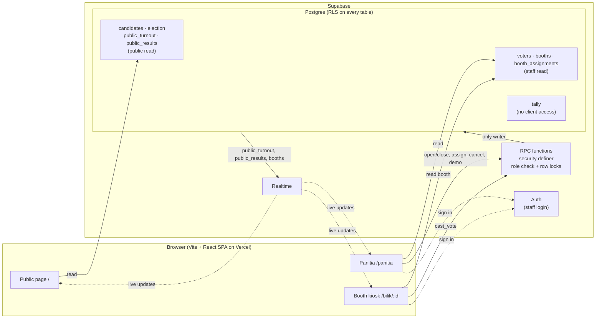
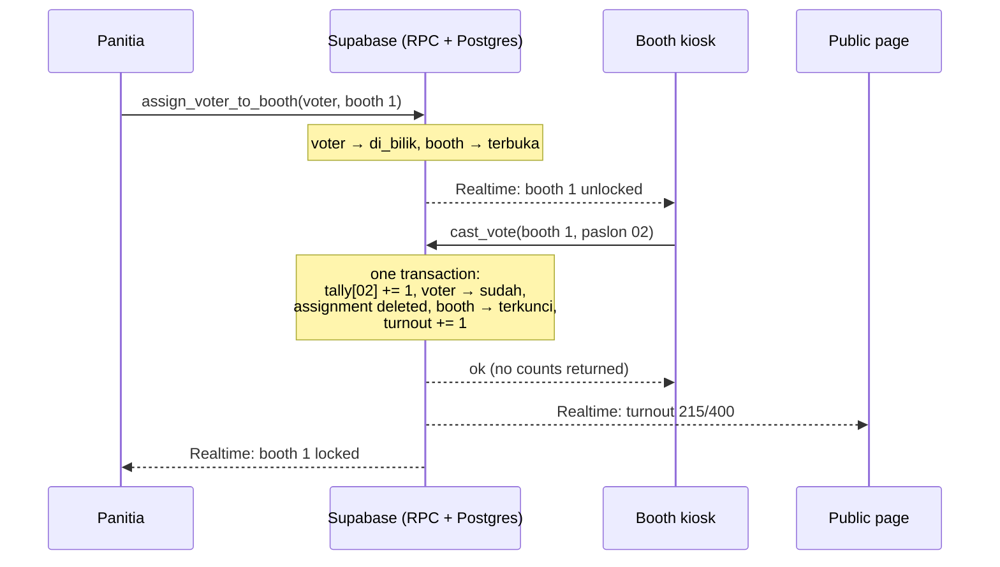

# Pemilu Raya MPS — E-Voting Booth System

A semi-offline polling-room system for a school election (Ketua & Wakil Ketua MPS, MAN Insan Cendekia Pasuruan),
built as a portfolio demo. Voting happens on committee-provided devices in a closed room; anyone can watch live
turnout online; per-candidate results stay sealed until voting closes.

> All candidate and voter data in this repository is **fictional**.

| Public page | Panitia control room | Booth kiosk |
|---|---|---|
|  |  |  |

<!-- Screenshots: add PNGs to docs/screenshots/ (public.png, panitia.png, bilik.png, results.png). -->

## Why

Paper ballots in a school election mean hours of counting one ballot at a time, arguments over unclear marks, and
room for human error in the tally. This system keeps the familiar parts — a verification desk, a private booth,
one person one vote — and removes the counting: totals are exact the moment voting closes.

## How it works

1. **Panitia** verifies a student at the desk (search by NIS or name) and **unlocks one booth** for them.
2. The **booth** (a tablet/laptop in kiosk mode) switches to the ballot in real time. The student picks a pair,
   confirms, and the booth **locks itself** again.
3. The **public page** shows live turnout ("214 dari 400 pemilih…") — never per-candidate numbers.
4. When panitia **closes voting**, results are published and revealed live on the public page.

| Route | Who | Purpose |
|---|---|---|
| `/` | Everyone | Hero, timeline, candidate visi & misi, live turnout, results after close |
| `/login` | Staff | Email + password |
| `/panitia` | Panitia | Open/close voting, verify voters, unlock/cancel booths, integrity check, demo tools |
| `/bilik/:id` | Booth device | Kiosk ballot for booth 1, 2, 3 |

## Architecture



There is no custom backend server: every rule lives in Postgres functions, so the browser can't bypass them.

### One vote, start to finish



## Ballot secrecy

**Who voted** and **what they chose** are never stored together.

- `voters.status` records only *that* a student voted (`belum` → `di_bilik` → `sudah`).
- `tally` holds one aggregate counter per candidate. There are no per-vote rows, timestamps, or session ids.
- `booth_assignments` (which voter is in which booth) is deleted in the same transaction that records the vote,
  and `cast_vote` never receives a voter id — only the booth and the candidate.
- `tally` has **no** client access at all (RLS on, no grants). Not even panitia can read per-candidate counts
  while voting is open; the dashboard's integrity check only sees totals.
- `public_results` stays **empty** until `set_election_status('ditutup')` copies the tally into it. Before that,
  per-candidate numbers exist in no API response — you can verify this in the browser's Network tab.

## One-vote rules

All writes go through `security definer` RPC functions (see `supabase/migrations/`). Each one checks the caller's
role and runs as a single transaction with row locks (`select … for update`), always in the same lock order to
avoid deadlocks.

| Rule | Enforced by |
|---|---|
| A booth can only vote while unlocked | `cast_vote` locks the booth row and rejects `terkunci` |
| Double-tapping "Ya, Saya Yakin" counts once | UI disables the button; the 2nd call waits on the booth lock, then sees it locked |
| A voter can't be assigned twice | `assign_voter_to_booth` rejects `di_bilik` and `sudah` |
| Two booths voting at once both count | `vote_count = vote_count + 1` under row locks |
| Voting can't close while a booth is open | `set_election_status` locks all booths and checks them |
| No votes after close, no reopening | status checks in every function |
| Integrity | `voters "sudah"` = `sum(tally)` = `public_turnout.voted_count`, shown green/red on the dashboard |

## Known limitations (acceptable for a demo)

- **Timing correlation.** Someone with direct database access watching `tally` in real time could match a count
  change to the moment a specific voter left the booth. Real mitigations (batched/delayed tally updates,
  shuffling, cryptographic schemes) are out of scope.
- **Trust in the operator.** Whoever holds the Supabase admin credentials could alter data directly. There is no
  append-only audit log or external verifiability.
- **One shared booth account.** All booth devices sign in as `bilik`; any booth device could act as any booth
  number (it still needs panitia to unlock that booth first).
- **Manual open/close.** Scheduled opening/closing is not implemented.
- **Demo tools** (`demo_simulate`, `demo_reset`) exist in the same database. A real deployment would remove them.

## Tech stack

Vite · React 19 · TypeScript · Tailwind CSS 4 · Motion · React Router · Supabase (Postgres, Auth, Realtime, RLS) · Vercel

## Setup

Requirements: Node.js 22.18+ (the seed generator runs TypeScript natively) and a free [Supabase](https://supabase.com) project.

```bash
npm install
cp .env.example .env.local   # then fill in the two values
npm run dev
```

1. **Database:** follow [`supabase/README.md`](supabase/README.md) — run the migration, the seed, create the two
   staff users, and link their roles.
2. **Environment:** `.env.local` needs `VITE_SUPABASE_URL` and `VITE_SUPABASE_ANON_KEY` (the anon/publishable key —
   never the service_role key).
3. **Run:** open `http://localhost:5173`. Staff log in at `/login`.

### Editing content

Election name, timeline, and candidate text live in one file: [`src/config/election.ts`](src/config/election.ts).
After changing candidates, regenerate and re-run the seed:

```bash
npm run seed:generate
```

In development, `http://localhost:5173/?mock` shows the public page with local mock data and a panel to switch
states (including results and a tie) without touching the database.

### Verify against your Supabase project

```bash
npm run verify
```

Signs in as anon, panitia, and bilik (asks for the two staff passwords) and runs a full election against the
real database: access rules, locked-booth and double-assignment rejections, a simultaneous double tap, three
booths voting at once, cancel, `demo_simulate`, closing, Realtime payloads (no per-candidate data before close),
and `demo_reset`. It resets the election at the start and the end.

### Deploy (Vercel)

1. Push this repository to GitHub.
2. In Vercel: **Add New → Project → Import** the repository (framework preset: Vite).
3. Add environment variables `VITE_SUPABASE_URL` and `VITE_SUPABASE_ANON_KEY`, then **Deploy**.

`vercel.json` rewrites all paths to `index.html`, so deep links like `/bilik/1` work.

## Demo script

1. Open three windows: `/`, `/panitia`, and `/bilik/1` (use a private window for the booth account).
2. Panitia opens voting → the public status and timeline change live.
3. Search a voter, unlock Bilik 1 → the booth unlocks live.
4. Vote and confirm → thank-you screen, booth re-locks, public turnout goes up.
5. **Mode Demo → Simulasikan 150** → turnout jumps; results stay hidden.
6. Close voting → the public page reveals the results.
7. **Reset Demo**.

## Project structure

```
src/
  config/election.ts     editable content (name, timeline, candidates)
  pages/                 one file per route
  components/public/     hero, timeline, candidate panels, turnout, results
  components/panitia/    election control, voter desk, booth monitor, stats, demo tools
  components/bilik/      kiosk screens
  lib/                   Supabase client, auth, types, formatting
supabase/
  migrations/            schema, RLS, RPC functions, Realtime
  seed.sql               generated by scripts/generate-seed.ts
```
